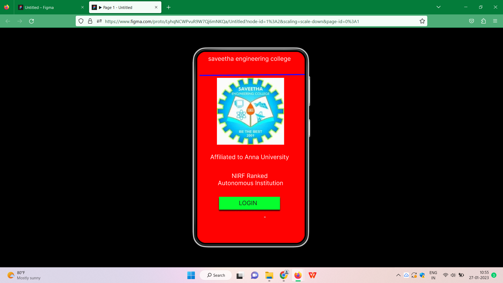
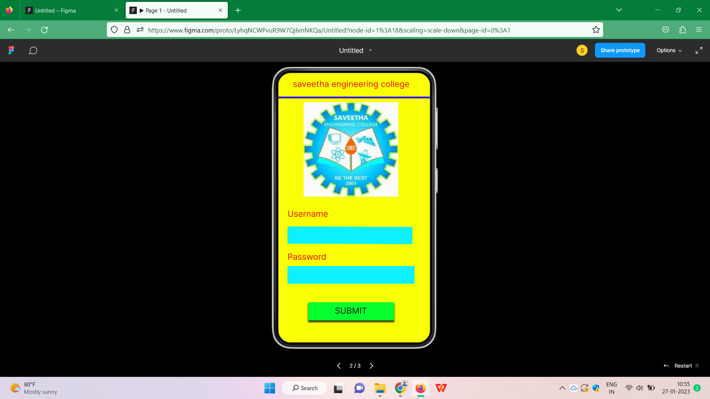
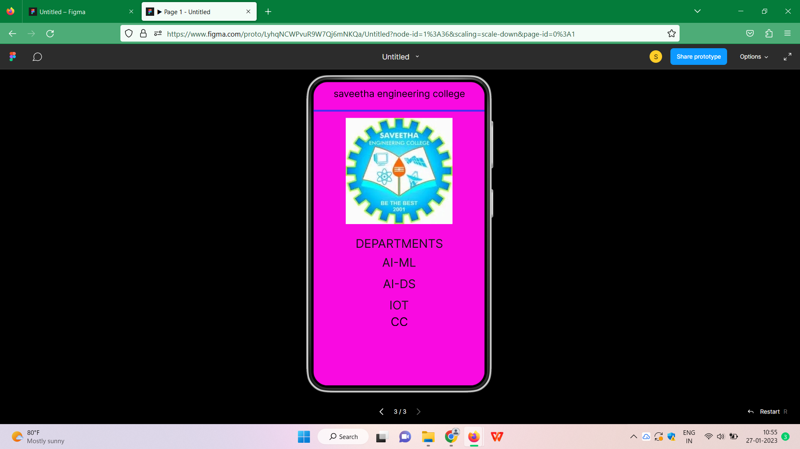

# Event Registration Web Application

## AIM:
To design, develop and deploy a web application for event registration.

## DESIGN STEPS:

### Step 1:
Create a new frame.

### Step 2:
Select any one preset size of your choice.

### Step 3:
Select the shapes you need.

### Step 4:
Import images as needed.

### Step 5:
Create pages based on your need and link them.

### Step 6:

Validate the HTML and CSS code.

### Step 6:

Publish the website in the given URL.

## DESIGN TOOL:
Figma

```
/* home page */

position: relative;
width: 360px;
height: 640px;

background: #FF0202;


/* SEC page */

position: relative;
width: 362px;
height: 712px;

background: #F90AE1;


/* saveetha 3 */

position: absolute;
width: 225px;
height: 224px;

background: url(saveetha.jpg);


/* saveetha 4 */

position: absolute;
width: 225px;
height: 224px;

background: url(saveetha.jpg);


/* login page */

position: relative;
width: 374px;
height: 699px;

background: #FAFF06;
```

## OUTPUT:




## RESULT:
The program to design, develop and deploy a web application for event registration is completed successfully.